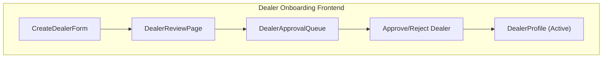
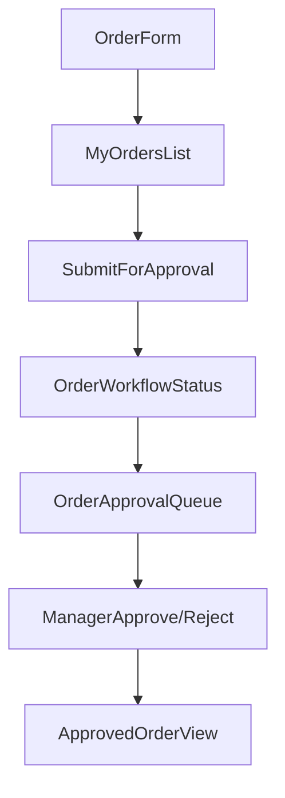

# Frontend Flows for Dealer → Order → Invoice → Payment

## Goal

Design and implement frontend screens and interactions that fully leverage the new backend workflows: dealer onboarding, user onboarding, order placement/approval, invoicing, and payments, with correct behavior per role.

---

## 1. Global Layout, Navigation, and Role-Aware Shell

- **Role-based shell**
  - Ensure the main layout reads the authenticated user (including `role`, `roleId`, `dealerId`, geo fields, `managerId`) from the auth token / `/auth/verify-otp` response.
  - Configure navigation sections that are **role-aware** (e.g., dealer dashboard vs. manager dashboard vs. finance view) and hide unauthorized features.
- **Shared utilities**
  - Centralize API client configuration (base URL, auth headers, error handling) and create typed helpers for the key backend modules: dealers, users, orders, invoices, payments, reports, tasks.
  - Implement a generic **table + filter + pagination** component that can be reused for list views (dealers, orders, invoices, payments, pricing, documents).

---

## 2. Dealer Onboarding UX (Admins & Managers)

- **Dealer creation wizard**
  - Screen for `super_admin`, `technical_admin`, `regional_admin`, `regional_manager`, `area_manager` to create a dealer via `POST /api/dealers`.
  - Steps: core info (code, name), contact details, geo mapping (Region → Area → Territory), financials (credit limit, payment terms), optional initial manager assignment.
  - On submit, show **status = Pending Approval** and current `approvalStage` from the response.
- **Dealer approval worklist**
  - Per-role approval page for `territory_manager`, `area_manager`, `regional_manager`, `regional_admin`:
    - Fetch dealers in their scope (`GET /api/dealers` with filters `status=pending_approval`, `approvalStage`).
    - Row actions: **Approve** / **Reject** using `PATCH /api/dealers/:id/approve` / `/reject` with remarks.
    - Show timeline / history (if you later expose workflow status for dealers) and geo context.
- **Dealer profile & lifecycle**
  - Dealer detail page (linked from everywhere) showing:
    - Core info, geo hierarchy, current `status`, workflow stage, manager, assigned sales executives, license verification info.
    - Actions (depending on role): Block/unblock, Verify (license), Assign region/manager.

---

## 3. User Onboarding UX (Dealer & Manager Hierarchy)

- **Admin user management**
  - Admin console pages for `super_admin`, `technical_admin`, regional/area/territory managers backed by `/admin/users`:
    - List users with filters (role, region/area/territory, dealer) and pagination.
    - Detail/edit dialogs using `POST /admin/users` and `PUT /admin/users/:id` with validation messages surfaced from backend.
- **Dealer Admin → Dealer Staff onboarding**
  - Dealer Admin screen to manage staff:
    - Use `/admin/users` scoped to `dealerId` to list only their staff.
    - New staff form **fixes `dealerId` to the current dealer** and requires `managerId` = current Dealer Admin; UI should:*
      - Hide region/area/territory fields for dealer_staff.
      - Auto-fill `managerId` as the Dealer Admin (but allow multiple admins if needed).
- **Sales Executive onboarding & assignment**
  - Manager console page for `territory_manager`/`area_manager`/`regional_manager`/`regional_admin`:
    - Create sales executives with required `managerId` (themselves or someone in allowed manager roles) via `/admin/users`.
    - Assignment screen backed by `/api/managers/assign-dealer` and `/api/dealers/assigned` to:
      - Pick a sales executive.
      - Attach/detach dealers within their scope (uses `UserDealer` mapping under the hood).

---

## 4. Dealer & Sales Executive Order Flow

- **Order creation UI**
  - Dealer-side ordering page for `dealer_admin`, `dealer_staff`:
    - Show product/material picker (backed by dealer-material mappings), quantity/price inputs, and computed totals.
    - Submit to `POST /api/orders` with implicit `dealerId` = user’s dealer.
  - Sales Executive ordering page:
    - First select a dealer from `/api/dealers/assigned` (dealers in their assignment list), then show the same ordering UI.
- **Order submission & tracking**
  - On creation, show order in **My Orders** (`GET /api/orders/my`), with state badges (`Pending`, `Pending Approval`, etc.).
  - Add **Submit for approval** action using `POST /api/orders/:id/submit` to start the workflow; update UI based on returned `approvalStage`/`approvalStatus`.
  - Order detail page should surface workflow status from `GET /api/orders/:id/workflow` and a timeline/history view.
- **Approval dashboards for managers**
  - Role-based queue for `dealer_admin`, `territory_manager`, `area_manager`, `regional_manager`, `regional_admin`:
    - Backed by `GET /api/orders/pending` and `GET /api/orders` (scoped).
    - Approve/Reject buttons calling `PATCH /api/orders/:id/approve` or `/reject` with remarks.

---

## 5. Invoice Flow (Dealer Staff/Admin & Managers)

- **Invoice creation from orders**
  - In dealer order detail, expose **Create Invoice** button only when `order.status = Approved`:
    - Opens a form prefilled from the order; posts to `POST /api/invoices` with `{ orderId, ... }`.
    - After success, direct to invoice detail screen.
- **Invoice listing & detail**
  - Invoice list and detail pages for roles from `invoiceRoutes` (dealer roles, sales executive, managers, finance, admins) using:
    - `GET /api/invoices` with filters (dealer, date range, status).
    - `GET /api/invoices/:id` and `GET /api/invoices/:id/pdf` for detail + PDF download.
  - Surface workflow timeline via `GET /api/invoices/:id/workflow` and add an approval status strip.
- **Invoice approval UI for management**
  - Approval queue page for managers backed by `GET /api/invoices/pending/approvals`:
    - Row actions to Approve/Reject via `PATCH/POST /api/invoices/:id/approve` or `/reject` with remarks.

---

## 6. Payment Initiation & Finance Workflow

- **Dealer payment initiation**
  - From dealer invoice detail or a **Due Payments** page (backed by `GET /api/payments/due`):
    - Show outstanding invoices with `balanceAmount > 0` and actions to **Initiate Payment**.
    - Payment form uses `POST /api/payments/request` with `invoiceId`, `amount` (pre-filled from balance), `paymentMode`, `utrNumber`, and optional proof upload.
  - Show pending/created payment requests in a **My Payments** or **Payments** tab (`GET /api/payments/mine`).
- **Dealer Admin approval & Finance review**
  - Dealer Admin pending payments list using `GET /api/payments/dealer/pending` with Approve/Reject actions pointing to `/api/payments/dealer/:id/approve`/`/reject`.
  - Finance dashboard for `finance_admin` using:
    - `GET /api/payments/pending` for queue.
    - Approve/Reject buttons using `POST /api/payments/:id/approve`/`/reject`.
    - Auto-reconciliation trigger/view (optional UI) using `GET /api/payments/reconcile`.
  - All payment detail views should show payment status, approval stage, and linked invoice state.

---

## 7. Dashboards, Reports, and Tasks

- **Role-specific dashboards**
  - Dealer dashboard: use `/reports/dashboard/dealer` and dealer performance APIs to show sales, outstanding, recent invoices/orders.
  - Manager dashboards: `/reports/dashboard/manager` and `/api/managers/summary` for dealer KPIs, pending docs/pricing, and sales trends.
  - Super admin dashboard: `/reports/dashboard/super` and `/admin/reports` for global KPIs and distribution by region.
- **Approval & task center**
  - Unified **Tasks** view (per user) built on `/api/tasks` (if available) or combined pending endpoints for orders, invoices, documents, pricing, and payments.
  - Each task row links into the correct entity detail page with approve/reject actions.

---

## 8. Notifications & Audit Surfacing (Frontend)

- **Notifications UI**
  - Implement a notifications dropdown/panel backed by existing notification endpoints (e.g., `/api/notifications`) and/or websocket events from `eventBus`.
  - Show events like: dealer activated, order submitted/approved/rejected, invoice created/approved/rejected, payment confirmed/rejected.
- **Audit visibility for admins**
  - Admin-only **Activity Log** page backed by `AuditLog` endpoints (or add them later) to show key actions with filters for entity type and user.

---

## 9. Frontend Implementation Priorities

1. **Baseline shell + auth integration** (role-aware nav and shared API client).
2. **Dealer & user onboarding UIs** (dealer wizard + user management for dealer_staff/sales_exec).
3. **Order creation & approval flows** (dealer + sales exec + managers).
4. **Invoice creation/approval & payments** (dealer, managers, finance).</plan>